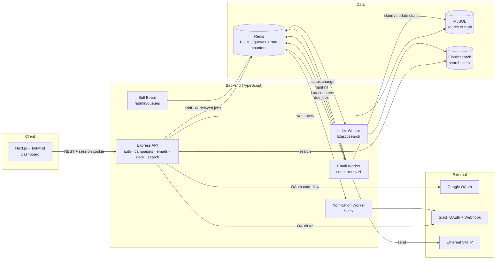
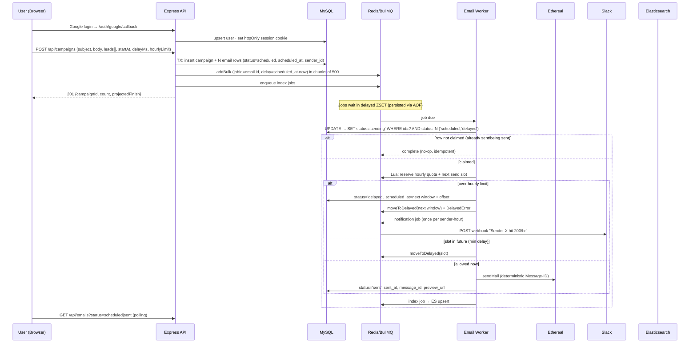

# ReachInbox Email Job Scheduler — Project Report

> Outbox Labs · Software Development Intern Assignment · Full-stack Email Job Scheduler
> Stack (as mandated): **TypeScript · Express.js · BullMQ + Redis · MySQL · Ethereal SMTP · Elasticsearch · React/Next.js + Tailwind · Google OAuth · Slack OAuth · Docker (recommended)**

---

## 1. Problem Statement

Build a **production-grade email scheduler service + dashboard**: a small slice of what ReachInbox runs under the hood. It must:

- Accept email send requests via an API, store them in **MySQL**, and schedule them with **BullMQ delayed jobs**. **No cron** of any kind (no crontab, `node-cron`, `agenda`).
- Send through **Ethereal SMTP** from **multiple senders**.
- **Survive restarts.** Future emails still go out at the right time, and nothing is re-sent or restarted from scratch (**idempotency**).
- Enforce **configurable worker concurrency**, a **minimum delay between sends**, and an **hourly rate limit** backed by Redis or DB counters. Jobs over the limit are **rescheduled to the next window in order**, never dropped.
- Send a **live Slack message** (through a real Slack OAuth connection) when a sender hits its hourly limit.
- Make scheduled and sent emails **searchable through Elasticsearch**, and expose a **live BullMQ dashboard**.
- Provide a **Figma-matched frontend** with real **Google login**, Scheduled and Sent tabs, and a Compose flow with CSV lead upload.
- Have a defined behavior for **1000+ emails due at the same moment**.

Deliverables: a private GitHub repo shared with **Mitrajit** and **Yadav036**, a README (run steps, Ethereal and env setup, architecture, feature mapping, trade-offs), a demo video of **≤ 5 minutes** that includes a **restart scenario**, and the ClickUp form. **Deadline: 48 hours.**

---

## 2. Requirement Checklist (what reviewers will verify)

| # | Requirement | Where it lives |
|---|---|---|
| B1 | Schedule API → MySQL → BullMQ delayed job (no cron) | `POST /api/campaigns`, `email.queue` |
| B2 | Multiple Ethereal senders | `senders` table + per-sender Nodemailer transport |
| B3 | Restart-safe, no duplicates | Redis AOF, `jobId = email.id`, DB status claim, boot reconciler |
| B4 | Configurable concurrency | `WORKER_CONCURRENCY` env |
| B5 | Min delay between sends | `MIN_SEND_INTERVAL_MS` (Redis slot reservation per sender) |
| B6 | Hourly limit, multi-instance safe, reschedule in order | Redis Lua counters `rl:{sender}:{hour}` + `moveToDelayed` |
| B7 | Slack OAuth + live notification on limit hit | `slack_integrations` table, notification queue |
| B8 | Elasticsearch search | `emails` index, `GET /api/emails/search` |
| B9 | Live BullMQ dashboard | Bull Board at `/admin/queues` |
| B10 | Behavior under 1000+ load | Chunked `addBulk`, limiter, overflow ordering |
| F1 | Real Google OAuth, header with name/email/avatar, logout | `/api/auth/*`, sidebar `UserMenu` (Figma user card) |
| F2 | Dashboard tabs + Compose button (Figma) | Sidebar with Scheduled/Sent + counts, `/scheduled`, `/sent` |
| F3 | Compose: subject, body, CSV upload with count, start time, delay, hourly limit | `/compose` page (From, To + Upload List, Send Later) |
| F4 | Scheduled and Sent tables with loading, empty, and error states | `EmailList` (reused) + `/emails/[id]` detail |
| F5 | Clean structure, reusable components, typed API | `components/ui`, `types/` |
| S | README, demo video, repo access, trade-offs | Root `README.md` |

---

## 3. System Architecture



**Processes.** One codebase with two entrypoints: `server.ts` runs the API and Bull Board, and `worker.ts` runs the email, notification, and index workers. Keeping them separate means workers scale on their own, and the restart demo can kill either process.

**Roles of each store:**

| Store | Role | Why |
|---|---|---|
| MySQL | Source of truth: users, senders, campaigns, emails, Slack integrations | Relational, transactional, required |
| Redis | BullMQ job state (delayed ZSET), rate-limit and slot counters, Slack dedupe keys | Required for BullMQ, atomic and shared across instances |
| Elasticsearch | Derived, rebuildable search index | Required. Never the source of truth |

---

## 4. Complete Workflow (end-to-end)



---

## 5. Phase-wise Architecture (build order)

The project is split into **9 phases**. Each one ends in something runnable, so if time runs out, everything already built still works.

| # | Phase | Hours | What gets built | Done when |
|---|---|---|---|---|
| **1** | **Setup and infrastructure** | 0–3 | Monorepo (`backend/`, `frontend/`), `docker-compose` (MySQL 8, Redis 7 with AOF + `noeviction`, ES 8 single-node), TypeScript and lint config, zod-validated `.env`, `.env.example` | `docker compose up` starts all three services, and both apps boot |
| **2** | **Database and senders** | 3–5 | Prisma schema (users, senders, campaigns, emails, slack_integrations), migrations, indexes, `seed:senders` script that creates 3 Ethereal accounts | Tables exist, and 3 senders are stored with encrypted passwords |
| **3** | **Core scheduling API** | 5–9 | `POST /api/campaigns` (validation, `schedulePlanner`, one DB transaction, chunked `addBulk` with `jobId = email.id`), `GET /api/emails`, `Idempotency-Key` handling | Posting 20 leads from Postman creates 20 rows and 20 delayed jobs |
| **4** | **Email worker and persistence** | 9–14 | Separate worker process, DB claim, per-sender pooled Nodemailer transport, status updates, retries with backoff, graceful shutdown, boot reconciler, Bull Board at `/admin/queues` | **Restart test passes:** stop both processes, start them again, and every email sends once at the right time |
| **5** | **Rate limiting and concurrency** | 14–20 | Redis Lua script (sender + campaign hourly counters, min-gap slot), `moveToDelayed` to the next window with an ordered offset, configurable `WORKER_CONCURRENCY`, `SMTP_DRY_RUN` + `load-test` script, limiter unit tests | 1,000 emails spread across hour windows in order, with none dropped or duplicated |
| **6** | **Google authentication** | 20–24 | Google OAuth code flow, user upsert, httpOnly JWT cookie, `requireAuth`, `/api/auth/me` and logout, Next.js `/api` rewrite, protected Bull Board | Real Google login lands on the dashboard, and the API rejects requests without a session |
| **7** | **Frontend dashboard** | 24–32 | UI primitives, header (avatar/name/email/logout), Scheduled and Sent tabs, login page, sidebar with user card (avatar/name/email/logout) and counts, reusable `EmailList` with loading/empty/error states, email detail page, Compose page (From dropdown, recipient chips, Upload List with lead count, rich-text editor, Send Later popover, projected finish time), toasts, Figma styling | A user can log in, schedule from the UI, and watch both tabs update |
| **8** | **Slack and Elasticsearch** | 32–39 | Slack OAuth (connect, callback, status, disconnect), notification queue and worker with per-sender-hour dedupe, ES index worker, `reindex-es` script, search endpoint and search bar | A live Slack message arrives on a limit hit, and search returns the user's emails |
| **9** | **Documentation, demo, and submission** | 39–48 | README (run steps, Ethereal and env setup, architecture, delay choice, rate-limit design, feature mapping, trade-offs), final Figma polish, demo video (≤ 5 min), repo access for Mitrajit and Yadav036, ClickUp form, buffer time | Submitted before the deadline |

**Risk order:** phases 3–5 carry most of the grade (the hard constraints), so they come first. Phase 8 has the most external risk (Slack HTTPS redirect, ES memory), so start the Slack app registration during phase 1 and use the waiting time in between.

---

## 6. Backend

### 6.1 Folder structure
```
backend/
  src/
    config/            env.ts (zod-validated), constants.ts
    db/                prisma client, migrations
    modules/
      auth/            google.routes.ts, session.ts, requireAuth.ts
      campaigns/       campaign.routes.ts, campaign.service.ts, schedulePlanner.ts
      emails/          email.routes.ts, email.repository.ts
      senders/         sender.service.ts, transportPool.ts
      slack/           slack.routes.ts, slack.service.ts
      search/          es.client.ts, email.index.ts
    queue/             connection.ts, queues.ts (email, notification, index), jobOptions.ts
    workers/           email.worker.ts, notification.worker.ts, index.worker.ts
    lib/               rateLimiter.lua, rateLimiter.ts, logger.ts, crypto.ts
    boot/              reconcile.ts
    app.ts  server.ts  worker.ts
  scripts/             seed-senders.ts, load-test.ts, reindex-es.ts
```

### 6.2 API surface
| Method | Path | Purpose |
|---|---|---|
| GET | `/api/auth/google` · `/api/auth/google/callback` | Google OAuth code flow |
| GET / POST | `/api/auth/me` · `/api/auth/logout` | Session user and logout |
| POST | `/api/campaigns` | Schedule a batch. Accepts an `Idempotency-Key` header |
| GET | `/api/emails?status=scheduled\|sent&page=&limit=` | Tables (paginated, user-scoped) |
| GET | `/api/emails/counts` | Sidebar counts (Scheduled, Sent) |
| GET | `/api/emails/:id` | Email detail view |
| GET | `/api/emails/search?q=&status=` | Elasticsearch search (top search bar) |
| GET | `/api/senders` | Senders for the Compose **From** dropdown, with current-hour usage |
| GET | `/api/integrations/slack/connect` · `/callback` · `/status` | Slack OAuth |
| DELETE | `/api/integrations/slack` | Disconnect |
| GET | `/admin/queues` | Bull Board (auth-protected) |
| GET | `/health` | Liveness (DB, Redis, ES) |

Every body is validated with zod, and every query is scoped by `user_id`.

### 6.3 Scheduling planner (plan time)
At creation, the planner computes `scheduled_at[i] = startAt + i × delayMs`, uses the sender chosen in **From**, and **also applies the campaign's hourly limit**: when index `i` exceeds the limit inside a window, it rolls over to the next hour. The UI can then show realistic times, and the runtime limiter only handles contention **between** campaigns that share senders.

### 6.4 Email worker (run time)
```ts
new Worker('email', processEmail, {
  connection, concurrency: env.WORKER_CONCURRENCY,        // e.g. 5
});
// Job options: jobId=`email-${id}`, attempts: 3, backoff: exponential 5s,
//              removeOnComplete: { age: 86400 }, removeOnFail: false
```
`processEmail(job, token)` runs these steps:
1. **Atomic claim** in MySQL (conditional `UPDATE … WHERE status IN ('scheduled','delayed')`). If no row is affected, the job is a no-op. A row stuck in `sending` longer than a stale threshold is reclaimable, which covers a crash mid-send.
2. **Rate check** with one Redis Lua script (section 9).
3. **Send** through a cached, pooled Nodemailer transport for the sender. The Message-ID is deterministic (`<email-{id}@reachinbox.local>`).
4. **Persist** `sent` with `sent_at`, `message_id`, and the Ethereal `preview_url`. On the final failed attempt, persist `failed` with the error.
5. **Enqueue** an index job, plus a notification job when the limit was hit.

---

## 7. MySQL Database

```sql
users(id PK, google_id UNIQUE, email UNIQUE, name, avatar_url, created_at)

senders(id PK, user_id FK NULL, email, smtp_host, smtp_port, smtp_user,
        smtp_pass_enc, hourly_limit NULL, is_active, created_at)

campaigns(id PK, user_id FK, sender_id FK, subject, body_html MEDIUMTEXT,
          body_text TEXT, start_at DATETIME(3),
          delay_ms INT, hourly_limit INT, total INT, idempotency_key UNIQUE NULL,
          created_at)

emails(id PK BIGINT, campaign_id FK, user_id FK, sender_id FK,
       recipient VARCHAR(320), subject, scheduled_at DATETIME(3),
       status ENUM('scheduled','delayed','sending','sent','failed'),
       attempts TINYINT, locked_at DATETIME(3) NULL, sent_at DATETIME(3) NULL,
       message_id NULL, preview_url NULL, error TEXT NULL,
       created_at, updated_at,
       UNIQUE(campaign_id, recipient),                 -- no duplicate lead per campaign
       INDEX(user_id, status, scheduled_at),           -- Scheduled/Sent tabs
       INDEX(status, scheduled_at))                    -- boot reconciler

slack_integrations(id PK, user_id FK UNIQUE, team_id, team_name, channel,
                   webhook_url_enc, connected_at, revoked_at NULL)
```
- **ORM:** Prisma, which is the fastest to build with and gives typed models and migrations.
- **Times:** every value is stored in UTC as `DATETIME(3)`. The frontend renders local time.
- **Secrets:** SMTP passwords and Slack webhook URLs are AES-encrypted with `ENCRYPTION_KEY`.
- **Body:** stored once on `campaigns` rather than copied per email, so 1000 leads don't mean 1000 copies.

---

## 8. Authentication

**Google (users):** the backend runs the OAuth 2.0 authorization-code flow (`passport-google-oauth20` or `google-auth-library`) with scopes `openid email profile`.
1. The frontend's "Continue with Google" link goes to `/api/auth/google`, which redirects to Google.
2. The callback verifies the code and `state`, upserts the user by `google_id`, and sets an **httpOnly, Secure, SameSite=Lax** signed JWT cookie (7 days).
3. The frontend calls `/api/auth/me` to render the header avatar, name, and email. Logout clears the cookie.
4. The `requireAuth` middleware protects `/api/*` and `/admin/queues`. Bull Board is additionally limited to an `ADMIN_EMAILS` allowlist.

**Same-origin trick:** Next.js `rewrites` proxy `/api/*` to Express. The cookie is then first-party, which avoids cross-site cookie and CORS problems in both dev and deployment. Register the Google redirect URI on the frontend origin.

**Slack (per-user integration):**
1. "Connect Slack" goes to `/api/integrations/slack/connect`, which redirects to `slack.com/oauth/v2/authorize?scope=incoming-webhook&state=<signed userId+nonce>`.
2. The callback verifies `state`, exchanges the code with `oauth.v2.access`, and stores `incoming_webhook.url`, the channel, and the team (encrypted) for that user.
3. The notification worker **looks up the integration at send time**, so a later connect starts working with no redeploy. If there's no integration, it skips quietly. A 404 or 410 from the webhook marks the integration revoked, and Disconnect deletes the row.
4. Messages are deduplicated with `SET slack:{user}:{sender}:{hour} NX EX 3600`, giving one alert per sender per hour rather than one per deferred job.

---

## 9. Queue, Scheduling, Rate Limiting and Concurrency

### 9.1 Queues
| Queue | Job | Why separate |
|---|---|---|
| `email` | Send one email (delayed) | The core path |
| `notification` | Slack message | A Slack outage must never block or fail sends |
| `index` | ES upsert | ES being slow or down never blocks sends. Retries are automatic |

### 9.2 Hourly limit and min delay: one atomic Lua script
Keys are **fixed UTC hour windows**, which are simple, explainable, and safe across instances:
```
KEYS: rl:s:{senderId}:{YYYYMMDDHH}   rl:c:{campaignId}:{YYYYMMDDHH}   slot:s:{senderId}
ARGV: senderLimit, campaignLimit, nowMs, minIntervalMs
→ if sCount >= senderLimit or cCount >= campaignLimit: return {OVER, 0}
→ slot = max(now, GET slot); SET slot = slot + minInterval
→ INCR both counters (EXPIRE 7200); return {OK, slot}
```
- **`OK` and `slot == now`:** send immediately.
- **`OK` and `slot > now`:** the counters are already reserved, so call `job.moveToDelayed(slot, token)` and throw `DelayedError`. This does **not** consume a retry attempt, and the job skips the check on its next run through a `job.data.reservedWindow` flag.
- **`OVER`:** `idx = INCR rl:overflow:{sender}:{nextHour}` gives `newTime = nextHourStart + idx × minInterval`, so **order is preserved**. The worker then updates the DB (`status='delayed'`, new `scheduled_at`), calls `moveToDelayed`, and queues the Slack notification.

**Why not BullMQ's built-in limiter?** `limiter` and `worker.rateLimit()` throttle the **whole queue**. One exhausted sender would stall every other sender, and per-key group limits are a BullMQ Pro feature. The custom Redis counters give **per-sender** limits that stay correct across any number of workers. This trade-off belongs in the README.

**Config (no hardcoding):** `WORKER_CONCURRENCY=5`, `MIN_SEND_INTERVAL_MS=2000` ("minimum 2 s between sends per sender"), `MAX_EMAILS_PER_HOUR_PER_SENDER=200`. The campaign hourly limit comes from the Compose form, and the effective limit is the smaller of the two.

### 9.3 Concurrency safety
Parallel jobs can't double-send because of (a) the unique `jobId` in BullMQ, (b) the conditional-UPDATE claim in MySQL, and (c) the atomic Lua reservation in Redis. The MySQL pool size is set to at least `WORKER_CONCURRENCY + API headroom`.

### 9.4 Behavior under load (1000+ emails due at the same time)
- **Ingest:** a single DB transaction with `createMany`, then `addBulk` in chunks of 500. The API responds in about a second.
- **Execution:** the worker pulls `concurrency` jobs at a time. The per-sender slot key spaces them `MIN_SEND_INTERVAL_MS` apart, and the hourly counter caps each window. Overflow lands in the next windows in FIFO order.
- **Example:** 1000 leads from one sender at 200/hr take 5 hour windows (200 each). If three campaigns on three different senders run at once, each sender has its own counter, so they don't slow each other down. Nothing is dropped or failed, and the Compose preview shows the same projection before the user clicks Schedule.
- **Demo:** `SMTP_DRY_RUN=true` switches to Nodemailer's `jsonTransport` (same library, no network), so `npm run load-test` can push 1000 jobs and print the per-hour distribution without spamming Ethereal.

### 9.5 Persistence and restart
- Redis runs with `appendonly yes`, `appendfsync everysec`, and **`maxmemory-policy noeviction`** (BullMQ requires this). Delayed jobs live in a Redis sorted set and survive restarts. When the worker comes back, it processes anything overdue straight away and anything in the future on time.
- **Graceful shutdown:** on `SIGTERM`, `worker.close()` lets in-flight jobs finish. Stalled-job detection re-queues jobs from a hard crash, and the DB claim stops them from re-sending.
- **Boot reconciler (MySQL ↔ Redis):** on startup (once, not on a timer), it scans `emails WHERE status IN ('scheduled','delayed')` and calls `queue.add` with the same `jobId` for any missing job. Because BullMQ ignores duplicate jobIds, this is idempotent. It covers a crash between the DB commit and the enqueue, and even a total Redis loss.

---

## 10. Elasticsearch
- **Index `emails`:** `recipient` (text + keyword), `subject` and `body` (text), `status` (keyword), `user_id` and `campaign_id` (keyword), `sender_email` (keyword), `scheduled_at` and `sent_at` (date).
- Every status change enqueues an `index` job that upserts by `id = email.id`. Because the upsert is idempotent, retries are safe.
- Searches use `multi_match` on subject, body, and recipient with a `term` filter on `user_id` and an optional `status` filter. Users only ever see their own emails.
- `scripts/reindex-es.ts` rebuilds the index from MySQL, which is possible because ES is derived data.

---

## 11. Frontend

**Stack:** Next.js (App Router) + TypeScript + Tailwind. Next.js is chosen for the `/api` rewrite (same-origin cookies) and simple routing.

### 11.1 What the Figma shows (7 frames)

The design is a **Gmail-style inbox**: white background, green accent, a left sidebar, and a list on the right. Compose is a **full page**, not a modal.

| Frame | What it contains | How to build it |
|---|---|---|
| **1. Login** | Centered card, "Login" title, green-tinted **Login with Google** button, "or sign up through email" divider, Email ID and Password fields, solid green **Login** button | Only Google login is required. Render the email/password fields to match the design but keep them disabled, with a "Use Google to sign in" hint, and state this in the README. Don't build password auth |
| **2. Dashboard: Scheduled** | Sidebar: logo, **user card** (avatar, name, email, dropdown), outlined green **Compose** button, "CORE" label, **Scheduled** and **Sent** items with counts. Main: **search bar**, filter and refresh icons, rows | Row: `To: <name>` · orange pill with clock icon and time (`Tue 9:15:12 AM`) · **bold subject** · grey body preview · star icon |
| **3. Dashboard: Sent** | Same layout, Sent item highlighted | Row pill is a grey **Sent** badge (a red **Failed** badge for failures) |
| **4. Email detail** | Back arrow, subject as title, star/archive/delete icons, sender avatar circle, sender name + address, "to me", date on the right, formatted body, image attachments | Opens when a row is clicked. Add an Ethereal preview link here for sent emails |
| **5. Compose (empty)** | Back arrow + "Compose New Email", attachment icon, clock icon, outlined **Send Later** button. Fields: **From** (sender dropdown), **To** with **Upload List** link, Subject, **Delay between 2 emails**, **Hourly Limit**, rich-text editor with toolbar | **From** picks one of the Ethereal senders. **Upload List** opens the CSV/text file picker |
| **6. Compose (leads loaded)** | **To** shows email chips (`tame@jmail.com`) plus a **+4** overflow chip | Show the first 3 chips, then `+N`. Also show "**N emails detected**" (a hard requirement) next to Upload List |
| **7. Send Later popover** | "Pick date & time" input with calendar icon, presets (Tomorrow, Tomorrow 10:00 AM, 11:00 AM, 3:00 PM), **Cancel** and **Done** | This sets the campaign **start time**. **Done** closes the popover, and the top button then schedules the campaign |

**Not required, so keep them visual or skip:** star, archive, and delete icons, file attachments, and the filter icon. The filter icon can simply switch the status filter (all/sent/failed). The **search bar** is where Elasticsearch search appears, and the **refresh** icon refetches the list.

### 11.2 Folder structure

```
frontend/src/
  app/
    login/page.tsx
    (app)/layout.tsx          sidebar + auth guard
    (app)/scheduled/page.tsx
    (app)/sent/page.tsx
    (app)/emails/[id]/page.tsx
    (app)/compose/page.tsx
  components/ui   Button · Input · Select · Chip · Badge · StatusPill · Popover · DateTimePicker ·
                  IconButton · Spinner · Skeleton · EmptyState · Toast · Avatar
  features/
    layout/       Sidebar.tsx · UserMenu.tsx (avatar, name, email, logout, Connect Slack) · NavItem.tsx
    emails/       EmailList.tsx (one reusable list for Scheduled and Sent) · EmailRow.tsx ·
                  EmailDetail.tsx · SearchBar.tsx · useEmails.ts · useCounts.ts
    compose/      ComposeForm.tsx · RecipientChips.tsx · UploadListButton.tsx · parseLeads.ts ·
                  SendLaterPopover.tsx · RichTextEditor.tsx · SchedulePreview.tsx
    slack/        SlackConnectButton.tsx
  lib/            api.ts (typed fetch wrapper, error normalisation) · format.ts (dates)
  types/          api.ts (Email, EmailDetail, Campaign, Sender, User, Counts, Paginated<T>, ApiError)
```

The assignment asks for a "top header" with name, email, and avatar. In the Figma this is the **user card at the top of the sidebar**, so the user card satisfies it. Its dropdown holds **Logout** and **Connect Slack**.

### 11.3 Behavior

- **Compose:**
  - Subject, a rich-text body, and **From** (sender).
  - Leads come from typing addresses into **To** or from **Upload List**. Parsing happens in the browser: extract emails with a regex, lowercase them, remove duplicates, and count invalid ones separately.
  - **Delay between 2 emails** and **Hourly Limit**.
  - Start time comes from **Send Later**.
  - **SchedulePreview** shows the projected finish time.
  - The final button calls `POST /api/campaigns` with an `Idempotency-Key`, then redirects to Scheduled with a toast.
- **Rich-text editor:** the toolbar in the Figma (undo/redo, font size, bold/italic/underline, alignment, lists, indent, quote, strikethrough) needs an editor library. Tiptap is the lightest fit. The body is stored as HTML and sent with Nodemailer's `html` option, with a plain-text fallback.
- **Lists:**
  - **Scheduled:** recipient, subject, scheduled time (orange pill), and status (`scheduled` or `delayed`).
  - **Sent:** recipient, subject, sent time, and status (`sent` or `failed`).
  - **Both:** skeleton rows while loading, an empty state, error toasts, pagination or "load more", and 5 s polling so statuses update live.
- **Sidebar counts:** come from `GET /api/emails/counts`.

**Quality bar:** props and API types are explicit, there is one `EmailList` for both tabs, and there is no duplicated fetch logic.

---

## 12. Deployment

**Local (primary, and what the demo uses):** `docker-compose.yml` runs `mysql:8`, `redis:7` (AOF + noeviction), and `elasticsearch:8` (single-node, security off for dev, `ES_JAVA_OPTS=-Xms512m -Xmx512m`). `backend` runs with `npm run dev:api` and `npm run dev:worker`, and `frontend` with `npm run dev`. Optionally, Dockerfiles for the api, worker, and frontend let `docker compose up` bring up the whole stack.

**Hosted (optional, nice to have):** Vercel for the frontend (rewrites to the API), Railway or Render for the API, worker, MySQL, and Redis, and Elastic Cloud trial or Bonsai for ES. Slack generally requires HTTPS redirect URLs, so a Slack demo needs either the hosted API or an HTTPS tunnel to localhost.

**Env (`.env.example`, all documented):**
`DATABASE_URL, REDIS_URL, ELASTICSEARCH_URL, GOOGLE_CLIENT_ID/SECRET, GOOGLE_CALLBACK_URL, SLACK_CLIENT_ID/SECRET, SLACK_REDIRECT_URI, JWT_SECRET, ENCRYPTION_KEY, FRONTEND_URL, ADMIN_EMAILS, WORKER_CONCURRENCY, MIN_SEND_INTERVAL_MS, MAX_EMAILS_PER_HOUR_PER_SENDER, SMTP_DRY_RUN`.
Ethereal: `npm run seed:senders` calls `nodemailer.createTestAccount()` about three times and stores the accounts as senders.

---

## 13. How the Components Interact (summary)

1. **Browser ↔ API:** same-origin REST through the Next.js rewrite, authenticated by an httpOnly cookie issued after Google OAuth.
2. **API → MySQL → Redis:** the campaign is written first as the source of truth, then its delayed jobs are enqueued with deterministic IDs. The boot reconciler repairs any gap between the two.
3. **Redis → Worker:** BullMQ promotes jobs when they're due. The worker claims each row in MySQL, reserves quota and a slot through Lua in Redis, then sends through Ethereal.
4. **Worker → side queues:** status changes feed the `index` queue (→ ES), and limit hits feed the `notification` queue (→ Slack webhook looked up from MySQL).
5. **Observability:** Bull Board reads the same Redis queues live. The dashboard reads MySQL for its tables and ES for search.

---

## 14. Key Architectural Decisions

| Decision | Choice | Reason / trade-off |
|---|---|---|
| Scheduler | BullMQ delayed jobs, one job per email | Native, persistent, visible in Bull Board. Costs more Redis memory than a DB poller, but is simpler and explicitly allowed |
| Source of truth | MySQL, with Redis as the execution layer | Tables and history survive even a Redis wipe, thanks to the reconciler |
| Idempotency | `jobId`, a conditional DB claim, a unique `(campaign, recipient)` key, and an API `Idempotency-Key` | Layered, so no single failure causes a double send. SMTP itself can't be exactly-once, so the claim keeps any duplicate window tiny, and the README says so honestly |
| Rate limiting | Custom Redis Lua with fixed hourly windows, per sender and per campaign | Multi-instance safe and per-sender. Fixed windows allow a burst at the boundary (documented) |
| Min delay | Per-sender slot reservation, plus campaign delay applied at plan time | Keeps senders independent. A global limiter would serialise all senders |
| Over-limit handling | `moveToDelayed` to the next window with an ordered offset | No drops, no retries burned, FIFO preserved |
| Side effects | Separate `notification` and `index` queues | Slack or ES failures never affect delivery |
| Processes | API and worker split | Independent scaling and a clear restart demo |
| Auth | Backend OAuth + httpOnly JWT cookie behind a same-origin rewrite | No tokens in localStorage, no CORS or cookie pain |

---

## 15. Challenges and Mitigations

| Challenge | Mitigation |
|---|---|
| Crash between the DB write and the enqueue | Boot reconciler with idempotent `jobId` |
| Crash mid-send (stalled job) | Claim with `locked_at` and a stale threshold, plus a deterministic Message-ID. Documented as at-least-once only at the SMTP boundary |
| Preserving order when rescheduling | Overflow index counter per next window |
| Redis evicting jobs or losing them on restart | `noeviction` + AOF in compose config |
| Timezones (user local vs server) | UTC everywhere, converted only in the UI |
| Slack OAuth needs HTTPS and a public redirect | Hosted API or HTTPS tunnel. Register the Slack app in phase 1 (phase 8 is time-risky) |
| Elasticsearch memory footprint | Single-node, 512 MB heap, async indexing, so the app works with ES down |
| 1000+ inserts and jobs | `createMany` + chunked `addBulk`, body stored once per campaign |
| Cross-domain cookies in deployment | Next.js rewrite for a same origin |
| Figma fidelity under time pressure | Build shared UI primitives first, then match spacing and colors last |

---

## 16. 48-Hour Priorities

**Must (non-negotiable, and graded):**
no cron · MySQL + BullMQ delayed jobs · restart persistence and idempotency · concurrency, min delay, and hourly limit with in-order reschedule · multiple Ethereal senders · real Google login · dashboard with Compose, Scheduled, and Sent · **live Slack notification** · **Elasticsearch search** · **Bull Board** · README · demo video with restart · repo access for **Mitrajit** and **Yadav036** · form.

**Should:** close Figma match, pagination, search UI, rate-limiter unit tests, `.env.example`, a Docker compose that runs everything.

**Could (only if time allows):** hosted deployment and the improvements in section 17.

**Timeline:** follow the 9 phases and hours in section 5. Checkpoints:
- **Hour 14:** the restart test passes (phase 4). If it doesn't, stop and fix it before moving on.
- **Hour 20:** rate limiting works under the 1,000-email load test (phase 5).
- **Hour 32:** the full UI flow works end-to-end (phase 7).
- **Hour 39:** every mandatory feature is done. After this point, only docs, polish, and the demo.

**Demo video (≤ 5 min):** login (0:00) → connect Slack (0:30) → compose with a CSV of 20 leads and a limit of 5/hr, showing the projection (1:00) → Scheduled tab + Bull Board delayed jobs (1:45) → the Slack alert arrives live (2:30) → **stop the API and worker, restart, and the future emails still send** (3:00) → Sent tab with Ethereal previews + ES search (4:00) → load-script output (4:30).

---

## 17. Improvements That Would Stand Out (within the existing stack)

1. **Transactional outbox + reconciler, named explicitly.** MySQL is the truth, jobs are derived, and on boot the system self-heals any row that has no job. It's the classic *Outbox pattern*, which suits Outbox Labs. It turns "survives restarts" into "survives even losing Redis", and it takes about 40 lines.
2. **Send-time projection in Compose.** The UI and worker share one pure function (`schedulePlanner`) that shows "1,000 leads · 200/hr · 2 s gap → finishes Tue 16:40" before the user schedules. Reviewers see that the rate-limit logic is deterministic and unit-tested.
3. **Ethereal preview links and a deterministic Message-ID in the Sent table.** Every sent row opens the actual captured email, which makes the demo verifiable in one click and shows idempotency thinking.
4. **Load and restart demo script.** `npm run load-test` (dry-run transport) schedules 1,000 emails and prints the per-hour and per-sender distribution. This covers the bonus "behavior under load" requirement with hard numbers rather than a verbal claim.

These use no new infrastructure. Each one strengthens a graded requirement rather than adding scope.

---

## 18. Assumptions to State in the README
- Senders are Ethereal test accounts shared across users. Slack alerts go to the owner of the campaign whose job hit the limit.
- Rate windows are fixed UTC hours, and the effective limit is the smaller of the sender env limit and the campaign form limit.
- Delivery is exactly-once at the application level and, at worst, at-least-once at the SMTP boundary after a hard crash mid-send.
- The UI refreshes by polling every 5 s rather than using websockets, which keeps the stack minimal.
- Elasticsearch is a derived index and can be rebuilt from MySQL.
